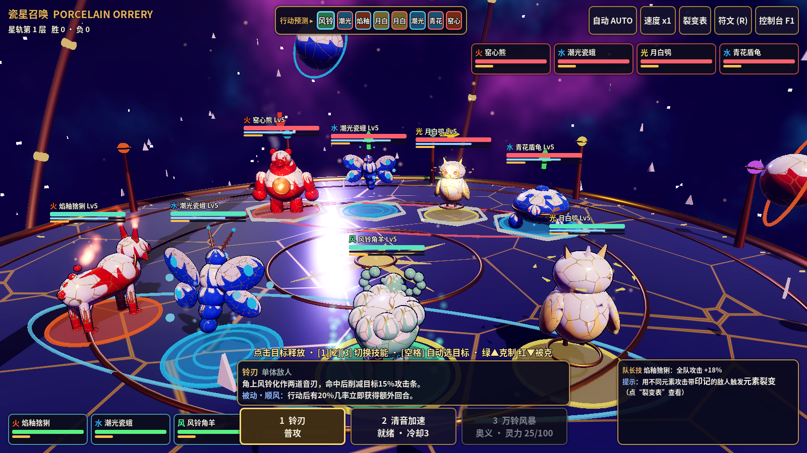

# 瓷星召唤 Porcelain Orrery

一个用 **Godot 4.3+** 做的 3D 回合制怪兽对战原型（类魔灵召唤），4v4，零外部素材：所有模型、材质、特效、音效都在运行时由代码生成。



## 运行

1. 安装 Godot 4.3 或更新版本（标准版，不需要 .NET）。
2. 用 Godot 打开本目录的 `project.godot`，按 **F5**。
3. 如果要放进你已有的项目：只复制 `orrery/` 文件夹，然后打开 `res://orrery/scenes/po_main.tscn` 按 **F6**。不要复制 `project.godot`。

## 画风：瓷偶 × 星仪

- 角色是**上釉的瓷偶机关兽**，每个元素对应一种釉色：火是郎窑红，水是青花钴蓝，风是青瓷，光是象牙金，暗是天目黑釉。
- 身上有**金缮（kintsugi）金色裂纹**。**血越少，裂纹越宽、越亮**，从裂缝里透出元素光。死亡时整只**碎成瓷片**，并散出金粉。
- 战场是漂浮在星云中的**黄铜星仪**：金缮大理石圆台，外面有巨大的旋转浑天环，五颗元素行星绕着转。
- 着色器都在 `orrery/shaders/`：瓷器与金缮、描边、星云天空。

## 战斗系统

| 系统 | 说明 |
|---|---|
| **ATB 攻击条** | 连续时钟：每 tick 攻击条增加 速度×7%，先满 100% 的单位行动；同时满条时速度高者先动 |
| **行动预测** | 顶部显示接下来 8 个行动者（按当前攻击条模拟）|
| **属性克制** | 火→风→水→火，光⇄暗。克制：伤害 +30%、暴击率 +15%、40% 概率碾压；被克：伤害 -15%、30% 概率偏斜（偏斜时无法附加减益）|
| **元素裂变** | 伤害技能会在目标身上留下施法者的元素印记；用**不同元素**打有印记的目标，会触发 6 种反应：焰暴（溅射）、蒸腾（削攻击条）、冰封、湮灭、辉光（治疗）、蚀裂（破防+持续伤害）|
| **灵力奥义** | 第 3 技能不看冷却，靠灵力：行动 +25、受击 +8、击杀 +15，满 100 可放 |
| **技能** | 每只 3 个技能 + 1 个被动 + 队长技（1 号位生效）|
| **增益/减益** | 攻击强化 +50%、防御强化 +70%、免疫；防御破坏 -70%、持续伤害（每回合 5%）、眩晕、冰冻 |
| **命中/抵抗** | 实际抵抗率 = max(15%, 目标抵抗 - 施法者命中)。瞄准时会显示实际命中率和预计伤害 |

### 角色（全部原创，共 8 只）

| 角色 | 元素 | 定位 | 特点 |
|---|---|---|---|
| 焰釉猞猁 Ember Lynx | 火 | 输出 | 持续伤害，对灼烧目标增伤 |
| 潮光瓷蛾 Tide Moth | 水 | 辅助 | 群体治疗、净化、全队拉条 |
| 风铃角羊 Chime Ram | 风 | 控速 | 全队拉条，概率获得额外回合 |
| 月白鸮 Lumen Owl | 光 | 治疗 | 治疗、免疫、自我净化 |
| 窑心熊 Kiln Bear | 火 | 斗士 | 胸口是窑炉，受击时涨攻击条 |
| 青花盾龟 Cobalt Shell | 水 | 坦克 | 高血量时减伤，冰冻控制 |
| 青瓷螳 Celadon Mantis | 风 | 刺客 | 对残血目标增伤 |
| 天目釉蛇 Tenmoku Serpent | 暗 | 法师 | 击杀后获得额外回合 |

## 操作

- **点击敌人**或**点击头像**选择目标。**1 / 2 / 3** 切换技能。**空格**让 AI 替你选目标。群体技能再按一次技能键即可释放。
- 目标头顶的箭头：**绿▲克制**，**黄◆无克制**，**红▼被克**。
- 右上角可以切换**自动战斗**、**1x/2x/3x 倍速**，查看**裂变表**，打开**符文盘（R）**。
- **F1 或 ~ 键**打开开发者控制台，功能有：瞬间获胜、击杀全部敌人、无限冷却加满灵力、我方满攻击条、倍速、自动战斗、回满血、刷传说符文、加召唤卷轴、重置存档。

## 养成循环

- **6 槽符文盘**：套装效果有猛攻 4 件（攻击 +35%）、活力 2 件（生命 +15%）、迅速 4 件（速度 +25%）、守护 2 件（防御 +15%）、刃 2 件（暴击率 +12%）。
- **胜利结算**：获得经验和升级、1–2 个符文，有概率获得召唤卷轴，之后进入下一层。每 5 层有一场首领战。
- **召唤卷轴**：随机召唤新角色，可以在符文盘里把它编入队伍。
- 存档位置：`user://porcelain_orrery_save.json`。

## 工程隔离

- 所有内容都在 `orrery/` 下，脚本前缀是 `po_`。
- **不使用 `class_name`**：脚本之间通过 `preload()` 常量引用，不会往全局类名空间里加东西（相当于命名空间隔离）。
- 不修改 Input Map、Physics Layers、Autoload、音频总线或渲染设置。环境光和天空是场景内的 `WorldEnvironment`。

## 自动测试 / 截图

```bash
godot --headless --path . -- --po-autotest                          # AI 对打 3 场后退出
godot --path . -- --po-screenshot=shot.png --po-shot-delay=6         # 截图后退出
```
