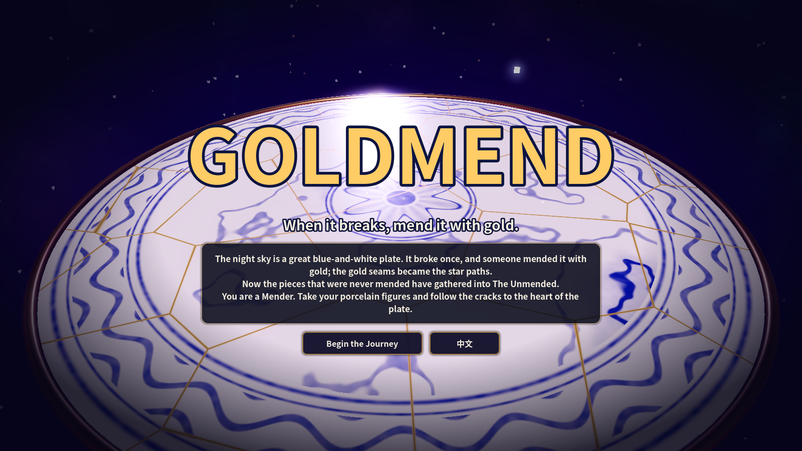
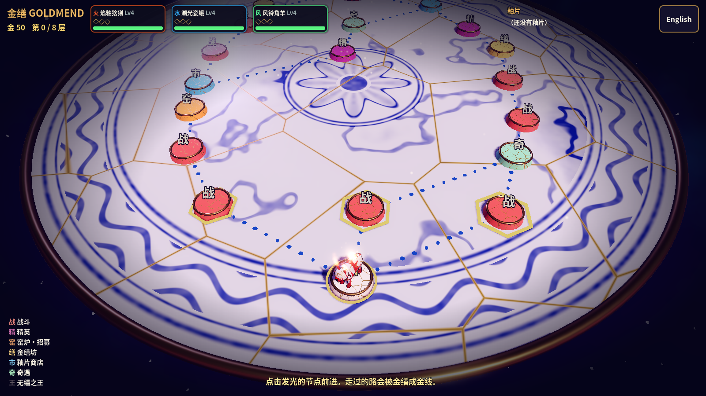
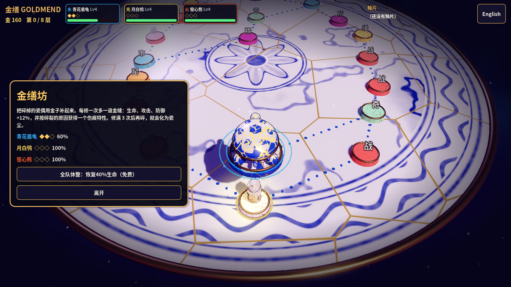
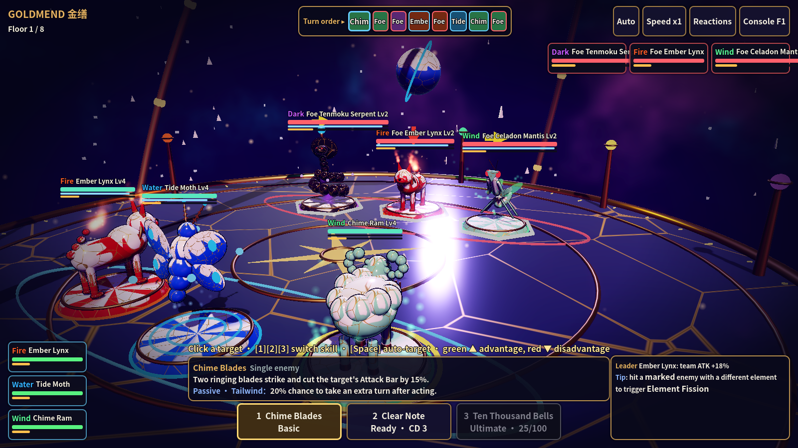
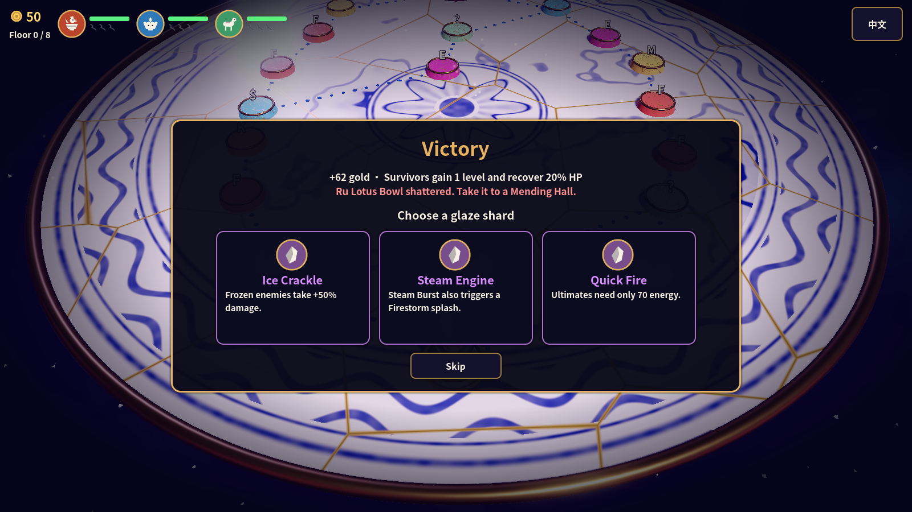

# 金缮 GOLDMEND

> 碎了，就用金子补起来。 · *When it breaks, mend it with gold.*

一款 roguelite 怪物收集战斗游戏的**可玩样本（一局约 15–20 分钟）**，用 **Godot 4.3+** 制作，支持**中文 / English** 一键切换。
A playable **one-run vertical slice** (~15–20 min) of a roguelite monster-collecting battler, built in **Godot 4.3+**, fully bilingual (**中文 / English**).



| 青花瓷盘地图 · Plate map | 金缮修补 · Gold mending |
|---|---|
|  |  |
| **战斗 · Battle** | **釉片奖励 · Glaze shards** |
|  |  |

## 运行 · Run

1. 安装 Godot 4.3 或更新版本（标准版即可）。Install Godot 4.3+ (standard build).
2. 用 Godot 打开 `project.godot`，按 **F5**。Open `project.godot` and press **F5**.
3. 在标题页或地图右上角切换语言。Switch language on the title screen or at the top-right of the map.

## 世界观 · Story

星空是一只巨大的青花瓷盘。它碎过一次，被人用金子补好，金线就是星轨。如今，没被补好的碎片聚成了「无缮之王」。你是缮星师：带上你的瓷偶，沿着裂痕走到盘心。

*The night sky is a great blue-and-white plate. It broke once and was mended with gold; the gold seams became the star paths. The pieces that were never mended have gathered into **The Unmended**. You are a Mender: take your porcelain figures and follow the cracks to the heart of the plate.*

## 器灵 · Vessel Spirits

每一只角色都是**真实存在的传世名瓷**化成的漫画形象；数据里记录了原型的国家、年代和器物名（`origin` 字段），以后可以扩展到代尔夫特、迈森、伊万里、伊兹尼克等其他国家的瓷器。器身用"旋转成型"（像拉坯一样）生成，釉面按真实工艺着色。
*Every character is a **real, museum-famous porcelain piece** drawn as a cartoon. Each carries an `origin` (country, era, piece), so the roster can grow to Delft, Meissen, Imari, Iznik and beyond. Bodies are lathe-turned like thrown pottery; glazes follow the real techniques.*

| 器灵 Spirit | 原型文物 Real piece | 元素 | 定位 Role | 釉面 Glaze |
|---|---|---|---|---|
| 鸡缸杯 Chicken Cup | 明·成化斗彩鸡缸杯 · Ming Chenghua doucai cup | 火 Fire | 输出 Striker | 斗彩 doucai enamels |
| 虎枕 Tiger Pillow | 宋金·磁州窑虎形枕 · Cizhou tiger pillow | 火 Fire | 斗士 Bruiser | 白地黑花 + 虎纹 |
| 汝窑莲碗 Ru Lotus Bowl | 北宋·汝窑天青釉莲花式温碗 · Ru ware lotus bowl | 水 Water | 辅助 Support | 天青 + 冰裂纹 crackle |
| 将军罐 General Jar | 清·康熙青花将军罐 · Kangxi blue-and-white jar | 水 Water | 坦克 Tank | 青花 blue-and-white |
| 三彩马 Sancai Steed | 唐·三彩马 · Tang sancai horse | 风 Wind | 控速 Tempo | 三彩流釉 running glaze |
| 凤耳瓶 Phoenix Vase | 南宋·龙泉窑青釉凤耳瓶 · Longquan celadon vase | 风 Wind | 刺客 Assassin | 梅子青 celadon |
| 孩儿枕 Child Pillow | 北宋·定窑白釉孩儿枕 · Ding ware child pillow | 光 Light | 治疗 Healer | 象牙白 ivory |
| 曜变盏 Yohen Bowl | 南宋·建窑曜变天目盏 · Jian "yohen" tea bowl | 暗 Dark | 法师 Caster | 曜变星斑 + 兔毫 |

每只器灵都有**专属招牌动作**（`po_anims.gd`）：鸡缸杯跳过去连啄三下，将军罐掀起罐盖飞到敌人头顶砸下，凤耳瓶的两只凤耳离开瓶身俯冲，孩儿枕把绣球抛出去再弹回来，虎枕伏低蓄力后飞扑，三彩马扬蹄踏地，汝窑莲碗前倾泼水，曜变盏倾倒星屑。
*Each spirit has **signature moves** (`po_anims.gd`): the rooster hops in and pecks, the General Jar hurls its lid onto the target, the phoenix handles detach and dive, the Child Pillow throws its ball, the tiger crouches and pounces, and more.*

标题页的「器灵图鉴」可以查看每只器灵的原型与小传。 *Open the **Codex** from the title screen for each spirit's origin and story.*

## 核心卖点 · Core hook

**碎裂与金缮 · Shatter & Mend**
- 瓷偶在战斗中阵亡会**碎裂**，它的血量和状态在整局中一直保留。*Figures that fall **shatter**; HP carries over between fights.*
- 在**金缮坊**花金子修补：每修一次**永久多一道发光的金缝**，生命、攻击、防御各 +12%，并按**碎裂的原因**获得伤痕特性（被火打碎得"耐火纹"，被暴击打碎得"韧胎"……）。*Mend them at a **Mending Hall**: each repair adds a permanent glowing gold seam (+12% HP/ATK/DEF) and a **scar trait based on how it broke**.*
- 金缝最多 3 道，**第 4 次碎裂就会化为瓷尘，永远离开**。*The 4th break turns it to dust, gone for good.*

## 一局流程 · A run

标题 → 选起始三人组 → 在**青花瓷盘**上走 8 层（走过的路会被金缮成金线）→ 首领「无缮之王」。
Title → choose a starting trio → travel 8 floors across the **porcelain plate** (your path is gilded as you go) → The Unmended.

| 节点 Node | 内容 Content |
|---|---|
| 战 Battle / 精 Elite | 4v4 以内的攻击条战斗；胜利得金子，并从 3 块釉片中选 1。*ATB battles; win gold and pick 1 of 3 glaze shards* |
| 窑 Kiln | 招募新瓷偶（最多 4 只）。*Recruit a new figure (team of up to 4)* |
| 缮 Mending Hall | 金缮修补碎裂的瓷偶，或全队休整。*Mend shattered figures or rest* |
| 市 Shop | 购买釉片、修复釉浆。*Buy glaze shards, repair slip* |
| 奇 Encounter | 3 个带选择的事件。*3 choice events* |
| 王 Boss | 无缮之王：场上有单位碎裂时它会变强。*The Unmended grows stronger whenever anything shatters* |

## 战斗 · Combat

- **攻击条 ATB**：每 tick 攻击条增加 速度×7%，先满者行动；顶部显示接下来 8 个行动者。*SPD-driven Attack Bar with an 8-turn forecast.*
- **属性克制 Elements**：火→风→水→火，光⇄暗。*Fire→Wind→Water→Fire, Light⇄Dark.*
- **元素裂变 Element Fission**：伤害会留下元素印记，用另一种元素命中带印记的目标会触发 6 种反应：焰暴、蒸腾、冰封、湮灭、辉光、蚀裂。*Marks + 6 reactions (Firestorm, Steam, Frostbind, Annihilation, Radiance, Corrosion).*
- **奥义 Ultimates**：靠灵力充能（行动 +25、受击 +8、击杀 +15）。*Charged by energy.*
- **信息透明**：瞄准时显示预计伤害、能否击杀、实际命中率、将触发的裂变。*Targeting previews damage, lethal, landing chance and reactions.*
- **15 块釉片**：改写规则，而不只是加数值，比如「双印：裂变后保留印记，可以连锁」「碎瓷锋：队友碎裂时全队拉条并强化」。*Rule-bending relics, e.g. chain reactions, rally on shatter.*

## 美术 · Art direction

**青花瓷 × 金缮 × 星空。** 所有模型、材质、特效、音效都在运行时由代码生成，没有任何外部素材。
**Blue-and-white porcelain × kintsugi × night sky.** Every model, material, effect and sound is generated at runtime; no imported assets.
- 瓷器着色器 `po_porcelain.gdshader`：元素釉色浸釉，加金缮裂纹。**血越少裂纹越亮**，修补次数越多金缝越粗越亮。*Glaze dip + kintsugi seams that glow as HP drops and thicken with each repair.*
- 青花盘着色器 `po_plate.gdshader`：海水纹、云纹、莲瓣盘心，盘面本身也带金缮。*Sea-wave band, cloud scrolls, lotus medallion, gilded cracks.*
- 角色站在瓷器底座上，像摆件一样；死亡时碎成瓷片，修补时碎片飞回原位。*Figurines on glazed plinths; they shatter into shards and reassemble when mended.*

## 界面 · UI

界面分三层：常驻画面只放图标和数字，说明在鼠标悬停时出现，完整规则放在规则页和图鉴里。所有图标都是代码里的 SVG（`po_icons.gd`），以后换美术只需要替换这一个文件。
*Three layers: icons and numbers on screen, details on hover, full rules in the rules page and Codex. All icons are inline SVG in `po_icons.gd`, so art can be swapped in one place.*

## 操作 · Controls

| 操作 Action | 按键 Key |
|---|---|
| 选目标 Target | 点击敌人 / 头像 · click enemy or portrait |
| 切换技能 Switch skill | **1 / 2 / 3** |
| 自动选目标 Auto-target | **空格 Space** |
| 自动战斗 / 倍速 Auto / Speed | 右上角按钮 · top-right buttons |
| 开发者控制台 Dev console | **F1** 或 **~** |

## 工程 · Project

- 代码全部在 `orrery/` 下（脚本前缀 `po_`），**不使用 `class_name`**，不修改 Input Map、Physics Layers、Autoload 或渲染设置。*All code under `orrery/`, no global class names or project-setting changes.*
- 文字：界面文字在 `po_i18n.gd` 的 `UI` 表；数据文字是 `po_data.gd` 里的 `name` / `name_en` 等双字段。*UI strings in `po_i18n.gd`; data texts carry `*_en` twins in `po_data.gd`.*
- 可选：把 glTF 模型放进 `orrery/models/` 替换程序化模型（见该目录 README）。*Optional glTF drop-in models, see `orrery/models/README.md`.*

```bash
godot --headless --path . -- --gm-autotest                       # AI 自动打完一整局 · AI plays a full run
godot --path . -- --gm-demo=map --gm-shot=map.png --gm-lang=en   # 截图 · screenshot (title|map|battle|mend|reward|end)
```
